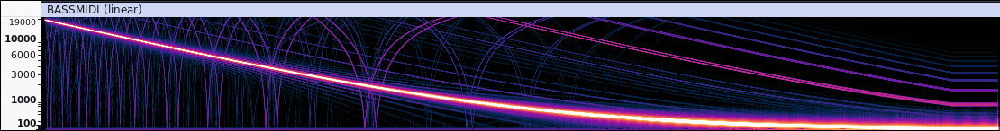
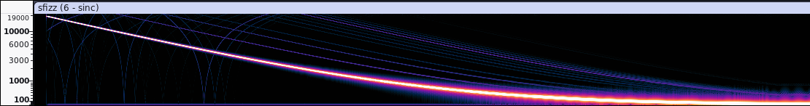
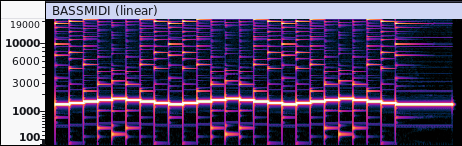
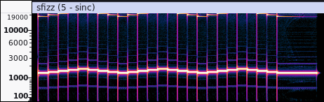
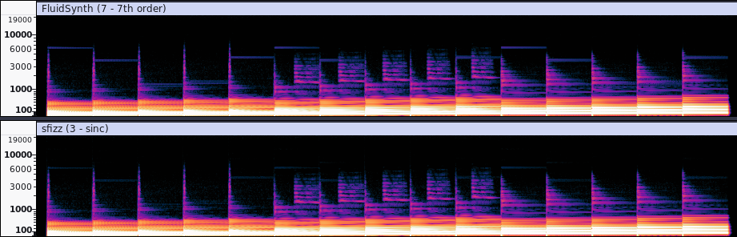
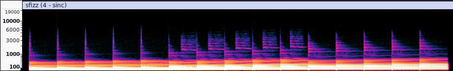
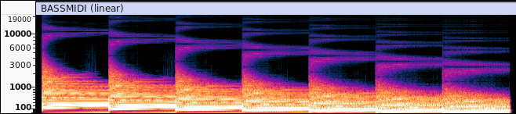
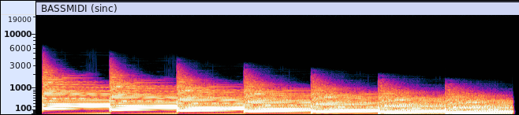
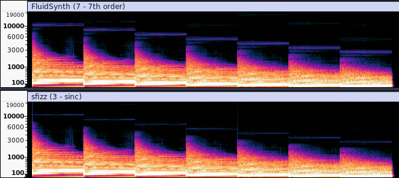

# Sample Interpolation Test
Test the quality of the sample interpolation method used by a SF2 or SFZ sampler.

*Updated 2/8/25 by S. Christian Collins*

Sample interpolation (aka "resampling") is an algorithm used to handle how an audio sample is played outside of its native sample rate. There are many resampling methods that attempt to balance sound quality vs. CPU usage. Simple methods, such as "linear", require little CPU, but have poor sound quality vs. something like "sinc", which can recreate a sound at different pitches with little to no distortion to the sound.

## Instructions

### SoundFont (SF2)

1. Load the included `.sf2` file into bank 0 or 1.
2. Play the accompanying `.mid` file.
3. Consult your SF2 sampler's documention for instructions on how to select different interpolation methods.

### SFZ

1. Load the included `.sfz` file into the SFZ sampler.
2. Play the accompanying `.mid` file. If you are using a VST plugin such as [sfizz](https://github.com/sfztools/sfizz) or [Plogue sforzando](https://www.plogue.com/products/sforzando.html), you should be able to drag the `.mid` file onto the track containing the plugin.
3. Open the `.sfz` file and uncomment and edit the `sample_quality=` opcode ([opcode description](https://sfzformat.com/opcodes/sample_quality/)) to override the sampler's default interpolation method. Note that this does not work in Plogue sforzando, but does work in sfizz. If this opcode does not work in the SFZ sampler you are testing, consult the sampler's documentation to see if there is another way to change interpolation method.

The interpolation methods available via the `sample_quality=` opcode include:

* 1: linear interpolation
* 2: higher quality interpolation, for example a polynomial interpolator
* 3-10: windowed sinc interpolation, using increasingly larger window sizes

The actual algorithms used for values 2-10 above may vary from sampler to sampler.

## Tests

The following tests will challenge a resampling algorithm in different ways. I also provide spectral analysis for each test based on the recorded audio in the `recordings` folder.

### Test 1: Sine Wave Sweep

The first test plays a descending sine wave sweep across most of the audible frequency range. With the ideal interpolation and sample, you should only see a singular, prominant frequency sweeping down. In reality, there will often usually be at least a tiny overtone presence in the sample, especially in a case such as the sample used for this test, which only has 24 samples per oscillation.

With linear interpolation, you will see a lot of frequencies accompanying the sine wave sweep. This includes overtones that follow the direction of the sine sweep as well as aliasing frequencies that sweep down and up in an arch-like pattern:

This arch-like pattern is heard as a swishing sound. This pattern is much harder to hear with higher quality interpolation, and becomes pretty much inaudible at the highest quality levels:

The outlier to this rule is FluidSynth's 7th-order interpolation, which creates quite audible aliasing, far worse than the cheaper 4th-order interpolation.

#### Test Result Ranking (Worst to Best)

* **Linear (all synths):** very noticeable aliasing
* **FluidSynth 7th-order:** very noticeable aliasing
* **sfizz sinc level 3:** reduced aliasing
* **BASSMIDI sinc, FluidSynth 4th-order & sfizz sinc levels 2, 4–10:** greatly reduced aliasing. Oddly, the aliasing in sfizz actually gets more noticeable as you increase the level between 4 and 10.

### Test 2: FM Electric Piano

The second test plays high samples of an FM electric piano moving up and down chromatically. With the ideal interpolation, all frequencies of the note should move together up and down with the notes. Cheaper interpolations will create a lot of harmonic distortions both above and below frequencies, due to the high frequency content present in the sample:

Once the interpolation quality is high enough, the frequency movement becomes true from note-to-note:

#### Test Result Ranking (Worst to Best)

* **Linear (all synths):** heavy harmonic distortion
* **FluidSynth 4th order, sfizz "higher quality" interpolation (level 2):** less harmonic distortion, but still quite prominent
* **FluidSynth 7th order, sfizz sinc level 3:** minimal harmonic distortion
* **sfizz sinc level 4:** harmonic distortion is slightly noticable
* **BASSMIDI sinc:** slight harmonic distortion that is not really noticeable
* **sfizz sinc levels 5-10:** no harmonic distortion

### Test 3: Electric Bass

The third test plays an ascending scale of electric bass notes. I've included this test because some interpolation methods cause a high frequency whine that appears on many of the notes. This shows up most prominently in FluidSynth's 7th-order interpolation and sfizz at interpolation level 3 (sinc). The whine appears as a horizontal line whose frequency varies from note to note:

This issue does not occur with linear, 4th-order, or higher-level sinc interpolation algorithms:

#### Test Result Ranking (Worst to Best)

* **FluidSynth 7th order:** audible whine on many notes
* **sfizz sinc level 3:** faintly audible whine on many notes
* **everything else:** no audible artifacts of any kind

### Test 4: Low Quality Timpani Sample

This test attempts to see how an interpolation method handles low-bitrate samples. Low quality interpolation methods will result in audible high-frequency aliasing noise. This noise is usually heard as a "grainy" ringing in the higher frequencies, and is quite prominant with linear interpolation:

With a high-quality sinc interpolation, the aliasing noise is completely eliminated:

However, as in test 3, both FluidSynth's 7th-order and sfizz's sinc interpolation at level 3 feature a high-frequency whine that can be seen as horizontal lines accompanying each sample:

For sfizz, this whine is far less audible, but certainly present. As you increase sfizz's sinc interpolation level, this whine decreases and is completely gone by sinc level 6.

#### Test Result Ranking (Worst to Best)

* **Linear (all synths):** heavy aliasing noise
* **FluidSynth 4th order & sfizz "higher quality" (level 2):** moderate aliasing noise
* **FluidSynth 7th order:** prominant high frequency whine
* **sfizz sinc level 3:** faint high frequency whine
* **sfizz sinc level 4:** barely audible high frequency whine
* **sfizz sinc level 5:** inaudible high frequency whine
* **BASSMIDI sinc & sfizz sinc levels 6-10:** no aliasing noise or whine

